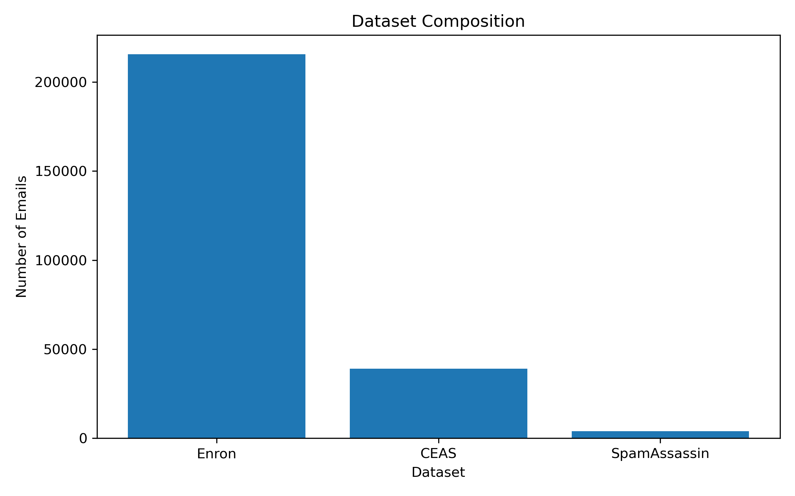

# Paper 1 Experimental Results

## Cybersecurity Data Engineering Framework

Generated Automatically: 2026-07-10 17:12:52.840240

---

# 1 Experimental Environment

The experiments were conducted using Python,
Jupyter Notebook,
Pandas,
NumPy,
PyTorch,
and Hugging Face Transformers.

Three benchmark datasets were integrated:

- CEAS 2008
- Enron
- SpamAssassin

# 2 Dataset Composition

## Table 1 Dataset Composition

| Dataset      |   Emails |   Percentage |
|:-------------|---------:|-------------:|
| Enron        |   215638 |        83.37 |
| CEAS         |    39039 |        15.09 |
| SpamAssassin |     3979 |         1.54 |

### Figure 1 Dataset Composition

# 3 Data Quality Evaluation

## Table 2 Data Quality Summary

**Missing:** table_02_data_quality_summary.csv

### Figure 2 Duplicate Reduction

### Figure 3 Missing Values

# 4 Cleaning Evaluation

## Table 3 Cleaning Evaluation

**Missing:** table_03_cleaning_evaluation.csv
# 5 Transformer Tokenization Evaluation

## Table 4 Tokenization Statistics

**Missing:** table_04_tokenization_statistics.csv

### Figure 4 Token Length Distribution

# 6 Computational Performance

## Table 5 Computational Performance

**Missing:** table_05_computational_performance.csv
# 7 Overall Evaluation Summary

## Table 6 Master Evaluation Summary

**Missing:** table_06_master_evaluation_summary.csv

### Figure 5 Proposed Cybersecurity Data Engineering Framework

# 8 Discussion

The quantitative results demonstrate the effectiveness
of the proposed cybersecurity data engineering framework
for preparing heterogeneous benchmark email datasets for
Transformer-based phishing detection.

The framework successfully standardized multiple datasets,
removed redundant observations,
cleaned textual noise while preserving security-relevant
information,
and produced a Transformer-compatible corpus suitable
for contextual embedding generation.

# 9 Conclusion

The experimental evaluation confirms that the proposed
framework provides a robust,
reproducible,
and scalable preprocessing pipeline
for phishing email research.

The resulting cleaned and tokenized corpus
provides the foundation for Student 2's
contextual embedding generation.

